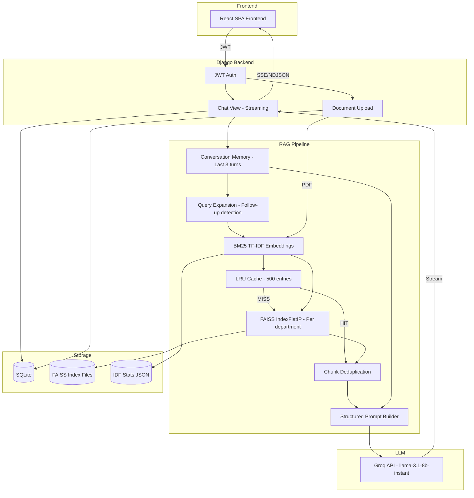

# IntraDoc AI — RAG Architecture & Techniques Summary

> A complete breakdown of every technique, optimization, and design decision used across the RAG pipeline.

---

## 1. Embedding & Vectorization

| Aspect         | Before (Original)                 | After (Optimized)                                         |
| -------------- | --------------------------------- | --------------------------------------------------------- |
| Method         | Naive bag-of-words hashing trick  | BM25-weighted TF-IDF with IDF statistics                  |
| TF Scoring     | Raw count (`+= 1.0`)              | BM25 saturation: `tf*(k1+1) / (tf + k1*(1-b+b*dl/avgdl))` |
| IDF            | None — all words weighted equally | Smooth IDF: `log((N-df+0.5)/(df+0.5) + 1)`                |
| Tokenization   | All words, no filtering           | Stop-word filtering (130+ words) + bigram phrases         |
| Hash Bins      | Single hash bin per term          | Dual hash distribution (70/30 split) to reduce collisions |
| Normalization  | L2 norm                           | L2 norm (same)                                            |
| Dimension      | 384                               | 384 (unchanged — no extra RAM)                            |
| External Model | None                              | None (still zero-dependency, fits 8GB RAM)                |

**Key file:** [embeddings.py](file:///Users/bishalkumarshah/IntraDoc_AI/ai/embeddings.py)

### Why BM25 over raw TF?

- **Term saturation** (`k1 = 1.5`): A word appearing 10 times isn't 10× more important than appearing once — BM25 caps diminishing returns
- **Length normalization** (`b = 0.75`): Short chunks aren't penalized vs. long ones
- **IDF weighting**: Rare domain-specific terms (e.g., "indemnification") get much higher weight than common words (e.g., "company")

---

## 2. FAISS Index & Retrieval

| Aspect            | Before                             | After                                                     |
| ----------------- | ---------------------------------- | --------------------------------------------------------- |
| Index Type        | `IndexFlatL2` (Euclidean distance) | `IndexFlatIP` (Inner Product / Cosine similarity)         |
| Scoring           | Lower distance = more relevant     | Higher score = more relevant (cosine similarity)          |
| Relevance Filter  | None — all top-k returned          | Minimum score threshold (`MIN_RELEVANCE_SCORE = 0.05`)    |
| Deduplication     | None                               | First-100-char dedup filter removes near-duplicate chunks |
| Document Deletion | Not supported                      | Full support via index rebuild                            |
| Cache             | None                               | LRU cache with TTL (see §5)                               |

**Key file:** [vector.py](file:///Users/bishalkumarshah/IntraDoc_AI/ai/vector.py)

### Why Inner Product over L2?

- For **normalized** vectors (which ours are), Inner Product = Cosine Similarity
- Cosine similarity measures **directional similarity** (semantic relatedness), not magnitude
- L2 distance can be misleading for sparse high-dimensional vectors

---

## 3. Document Processing & Chunking

| Aspect             | Before                         | After                                                                                           |
| ------------------ | ------------------------------ | ----------------------------------------------------------------------------------------------- |
| Chunk Size         | 500 characters                 | 800 characters                                                                                  |
| Chunk Overlap      | 50 characters                  | 150 characters                                                                                  |
| Min Chunk Length   | 20 characters                  | 40 characters                                                                                   |
| Text Cleaning      | Basic whitespace normalization | Page number removal, header/footer stripping, tab cleanup, artifact removal                     |
| Boundary Detection | Sentence-end only (`. ? !`)    | Priority chain: paragraph break → sentence → question/exclamation → newline → semicolon → comma |
| Search Window      | Last half of chunk             | Last third of chunk (better boundary selection)                                                 |

**Key file:** [services.py](file:///Users/bishalkumarshah/IntraDoc_AI/documents/services.py)

### Why 800 chars with 150 overlap?

- **800 chars** provides enough context per chunk for the LLM to understand meaning (≈ 150-200 words)
- **150 char overlap** ensures information at chunk boundaries isn't lost
- Original 500/50 was too granular — chunks lacked sufficient context for coherent answers

---

## 4. RAG Pipeline & Prompt Engineering

| Aspect                   | Before                        | After                                                                      |
| ------------------------ | ----------------------------- | -------------------------------------------------------------------------- | ----------------- |
| Conversation Memory      | None — each query independent | Last 3 turns of chat history included in prompt                            |
| Query Expansion          | None                          | Follow-up detection + automatic context expansion                          |
| Prompt Structure         | Simple "Context + Question"   | Structured system prompt with role awareness, strict rules, memory section |
| Role Awareness           | Not in prompt                 | User's access level explicitly stated in prompt                            |
| Chunk Metadata in Prompt | `[Document N - DEPT]`         | `[Document N — DEPT                                                        | Relevance: 0.XX]` |

**Key file:** [rag.py](file:///Users/bishalkumarshah/IntraDoc_AI/ai/rag.py)

### Conversation Memory Implementation

```
Flow: User asks Q → Fetch last 3 ChatLog entries → Format as "User: / Assistant:" pairs
     → Inject into prompt's MEMORY section → LLM sees conversation continuity
```

### Follow-up Query Expansion

- Detects follow-ups via: short queries (≤6 words), pronoun usage ("it", "this", "that"), continuity phrases ("what about", "tell me more")
- Expands by prepending the previous query: `"what about it?" → "What is the leave policy? what about it?"`
- This improves FAISS retrieval for ambiguous follow-ups

### Prompt Template Design

```
System Rules → Role declaration → Memory section (optional) → Document context with scores → Question
```

- **Strict grounding rules**: "Answer ONLY using provided context", "Do NOT make up information"
- **Output formatting**: Instructs bullet points, numbered lists, quoting document sections
- **Repeat penalty** in LLM params prevents hallucination loops

---

## 5. LLM Configuration (Groq API)

| Parameter                  | Before                     | After                          | Rationale                                         |
| -------------------------- | -------------------------- | ------------------------------ | ------------------------------------------------- |
| Temperature                | Default (0.8)              | **0.3**                        | Lower = more factual, less creative hallucination |
| Top-p                      | Default (0.9)              | **0.85**                       | Slightly focused nucleus sampling                 |
| Context Window (`num_ctx`) | Default (4096)             | **2048**                       | Saves ~2GB RAM on 8GB system                      |
| Repeat Penalty             | Default (1.0)              | **1.15**                       | Penalizes repetitive/looping outputs              |
| Max Tokens (`num_predict`) | Unlimited                  | **512**                        | Keeps responses focused, faster generation        |
| Top-k                      | Default (40)               | **40**                         | Unchanged                                         |
| Connection                 | New connection per request | **`requests.Session`** pooling | Reuses TCP connections, faster                    |
| Timeout                    | 120s                       | **180s**                       | More headroom for complex queries                 |
| Streaming                  | ✅ Yes                     | ✅ Yes                         | Token-by-token streaming to frontend              |

**Key file:** [llm.py](file:///Users/bishalkumarshah/IntraDoc_AI/ai/llm.py)

---

## 6. Caching (Latency Optimization)

| Cache           | Max Size    | TTL        | Purpose                                              |
| --------------- | ----------- | ---------- | ---------------------------------------------------- |
| Search Cache    | 500 entries | 10 minutes | Caches FAISS search results by (query + departments) |
| Embedding Cache | 200 entries | 5 minutes  | Reserved for future per-query embedding caching      |

**Key file:** [cache.py](file:///Users/bishalkumarshah/IntraDoc_AI/ai/cache.py)

### Implementation Details

- **Thread-safe** LRU (OrderedDict) with Lock
- **Deterministic keys** via SHA-256 hash of `query.lower() + sorted(departments)`
- **Auto-eviction**: Oldest entries removed when full; expired entries removed on access
- **Invalidation**: Automatic on document upload/delete (stale results cleared)
- **Memory overhead**: ~5MB at max capacity (negligible on 8GB)
- **Cache stats** exposed via `/api/health/` endpoint (hits, misses, hit rate)

### Latency Impact

```
Without cache: Query → Embed (CPU) → FAISS search (CPU) → LLM (GPU) → Stream
With cache:    Query → Cache HIT → LLM (GPU) → Stream
               (skips embedding + FAISS entirely on repeated/similar queries)
```

---

## 7. Database & Storage

| Component        | Technology                | Details                                                        |
| ---------------- | ------------------------- | -------------------------------------------------------------- |
| Primary DB       | **SQLite**                | Stores users, documents metadata, chat logs                    |
| Vector Store     | **FAISS (CPU)**           | In-memory indexes, persisted to disk as `.faiss` files         |
| Metadata Store   | JSON files                | Per-department `_metadata.json` alongside FAISS indexes        |
| IDF Statistics   | JSON file                 | `idf_stats.json` — doc count, term frequencies, avg doc length |
| Auth             | **JWT** (SimpleJWT)       | Access token (60 min) + Refresh token (7 days)                 |
| Password Hashing | **bcrypt** (BCryptSHA256) | Industry-standard password security                            |
| Chat History     | `chat_logs` table         | Stores query, full response text, context chunks, timestamp    |

### Data Flow

```
PDF Upload → PyPDF extract → Clean text → Chunk (800/150) → Embed (BM25 TF-IDF)
          → FAISS index → Persist to disk → Invalidate cache
```

---

## 8. Security & Access Control (RBAC)

| Feature              | Implementation                                                           |
| -------------------- | ------------------------------------------------------------------------ |
| Authentication       | JWT Bearer tokens via `djangorestframework-simplejwt`                    |
| Role Model           | 4 roles: ADMIN, HR, ACCOUNTS, LEGAL                                      |
| Department Isolation | FAISS indexes are per-department; queries scoped to user's department(s) |
| ADMIN Access         | Searches across ALL department indexes                                   |
| Upload Control       | Non-admins can only upload to their own department                       |
| Prompt Isolation     | User role explicitly stated in LLM prompt for context-aware answers      |

---

## 9. Frontend / User Experience

| Feature       | Before               | After                                               |
| ------------- | -------------------- | --------------------------------------------------- |
| Design        | Basic dark panels    | Glassmorphism, gradient accents, micro-animations   |
| Typography    | System fonts         | Google Fonts (Inter)                                |
| Chat UX       | Plain text rendering | Markdown parsing (bold, lists, code, blockquotes)   |
| Loading State | "Thinking..." text   | Animated dot typing indicator                       |
| Notifications | `alert()` dialogs    | Toast notifications (success/error/info)            |
| File Upload   | Basic file input     | Drag-and-drop zone with visual feedback             |
| Suggestions   | None                 | Clickable suggestion chips                          |
| System Status | None                 | Live status indicator (Groq health + cache stats) |
| Metadata      | Post-response text   | Styled chunk-info badges                            |
| Avatars       | None                 | User/AI avatar circles with initials                |
| Animations    | None                 | Message slide-in, hover effects, pulse indicators   |

**Key location:** `frontend/`

---

## 10. Management & Operations

| Feature                 | Details                                                                             |
| ----------------------- | ----------------------------------------------------------------------------------- |
| Index Rebuild           | `python manage.py rebuild_indexes` — re-processes all documents with new embeddings |
| Dry Run                 | `--dry-run` flag to preview what would change                                       |
| Health Endpoint         | `GET /api/health/` — Django, Groq API, FAISS, Cache status                            |
| Cache Auto-invalidation | Adding/removing documents automatically clears relevant cache entries               |

---

## 11. Architecture Diagram



---

## 12. RAM Optimization Summary (8GB Target)

| Decision                                      | RAM Saved                           |
| --------------------------------------------- | ----------------------------------- |
| No sentence-transformers / HuggingFace models | ~2-4 GB                             |
| `num_ctx: 2048` instead of 4096               | ~1-2 GB                             |
| `num_predict: 512` max tokens                 | Faster generation, less buffering   |
| LRU cache capped at 500 entries               | ~5 MB max                           |
| FAISS CPU (not GPU)                           | Uses system RAM, not VRAM           |
| SQLite (not PostgreSQL)                       | ~0 overhead vs. Postgres server     |
| Numpy-only embeddings                         | ~50 MB vs. ~500 MB for transformers |

**Estimated total RAM usage**: ~200 MB (Django + FAISS, LLM runs via Groq API) = **~200 MB total**

---

## 13. File Map

| File                                        | Purpose                                      |
| ------------------------------------------- | -------------------------------------------- |
| `ai/embeddings.py`                          | BM25 TF-IDF embedding engine (NEW)           |
| `ai/cache.py`                               | LRU cache with TTL (NEW)                     |
| `ai/vector.py`                              | FAISS vector store (REWRITTEN)               |
| `ai/rag.py`                                 | RAG pipeline with memory (REWRITTEN)         |
| `ai/llm.py`                                 | Groq API service with tuned params (REWRITTEN) |
| `ai/views.py`                               | Health check + cache stats (UPDATED)         |
| `ai/management/commands/rebuild_indexes.py` | Index rebuild command (NEW)                  |
| `documents/services.py`                     | PDF processing + chunking (REWRITTEN)        |
| `frontend/`                                 | React SPA Frontend (REWRITTEN)               |
